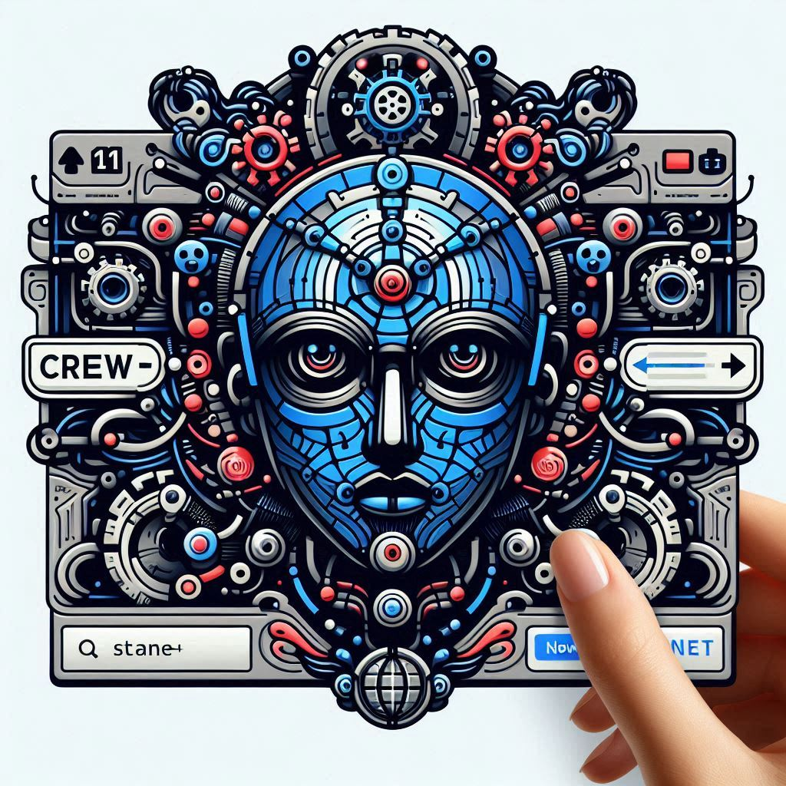

<a name="readme-top"></a>

<!-- PROJECT LOGO -->
<br />
<div align="center">
<!-- Titre à modifiés -->

  <h1>CrewAI Manager</h1>

[](https://github.com/Erik-42/crewai-manager.git) + [](https://github.com/Erik-42/crewai-manager.git)

</div>

<!-- TABLE OF CONTENTS -->
<details>
  <summary>Table of Contents</summary>
  <ol>
    <li><a href="#about-the-project">About The Project</a></li>
    <li><a href="#description">Description</a></li>
    <li><a href="#os">OS</a></li>
    <li><a href="#built-with">Built With</a></li>
    <li><a href="#installation">Installation</a></li>
    <li><a href="#usage">Usage</a></li>
    <li><a href="#testez-le-projet">Testez le projet</a></li>
    <li><a href="#structure-du-projet">Structure du projet</a></li>
    <li><a href="#license">License</a></li>
    <li><a href="#contact">Contact</a></li>
  </ol>
</details>

<!-- ABOUT THE PROJECT -->

## About The Project

<div align="center">

[![Contributors][contributors-shield]][contributors-url]
[![Forks][forks-shield]][forks-url]
[![Issues][issues-shield]][issues-url]
[![License][license-shield]][license-url]

Repo: [](https://wakatime.com/badge/github/Erik-42/crewai-manager)
<br/>
Projet: [](https://wakatime.com/badge/user/f84d00d8-fee3-4ca3-803d-3daa3c7053a5/project/8da282fb-9d68-4024-bb72-5f514c4f309d)

</div>

## Description du projet

CrewAI Manager est une interface web pour gérer et interagir avec CrewAI, un framework d'intelligence artificielle collaborative. Ce projet intègre CrewAI avec d'autres outils d'automatisation et de synchronisation pour créer une plateforme puissante et flexible.

### Composants principaux

1. **CrewAI** : Framework d'IA pour la création d'agents collaboratifs.
2. **n8n** : Plateforme d'automatisation de workflows.
3. **Syncthing** : Outil de synchronisation de fichiers décentralisé.
4. **Flask** : Framework web Python pour l'interface utilisateur.

### Fonctionnalités

- Interface web pour interagir avec les agents CrewAI.
- Intégration avec des modèles de langage via Hugging Face.
- Automatisation de tâches et de workflows avec n8n.
- Synchronisation de fichiers entre différents dispositifs avec Syncthing.

#### Il y a plusieurs éléments à modifiés dans ce modèle:

[x] - Le nom du projet

[x] - Le logo du projet

[x] - La description du projet

[] - Les liens wakatime

[] - Les liens des badges

[] - Les OS supportés

[] - Les technologies utilisées

[] - Les instructions d'installation

[x] - Les instructions d'utilisation

[]- La License

<p align="right">(<a href="#readme-top">back to top</a>)</p>

## Built with

<p> </p>
<a href=https://github.com/Erik-42?tab=repositories&q=&type=&language=html&sort= >  </a>
<a href=https://github.com/Erik-42?tab=repositories&q=&type=&language=css&sort= >  </a>
<a href= https://github.com/Erik-42?tab=repositories&q=&type=&language=sass&sort= >  </a>
<a href= https://github.com/Erik-42?tab=repositories&q=&type=&language=github&sort= >  </a>

<p align="right">(<a href="#readme-top">back to top</a>)</p>

<!-- Les instructions d'installation à modifiés -->

## Installation et configuration

1. Cloner le repository.
2. Installer les dépendances dans l'environnement virtuel.
3. Configurer n8n et Syncthing selon les besoins.
4. Lancer l'application Flask.
<p align="right">(<a href="#readme-top">back to top</a>)</p>

<!-- Les instructions d'utilisation à modifiés -->

## Utilisation

Accédez à l'interface web via `http://[adresse-ip]:5000/crewai` pour interagir avec CrewAI et gérer vos agents et tâches.

<p align="right">(<a href="#readme-top">back to top</a>)</p>

<!-- Les instructions de test à modifiés -->

## Tests

Utilisez `test-crew.py` pour exécuter des tests sur les fonctionnalités de CrewAI.

<p align="right">(<a href="#readme-top">back to top</a>)</p>

## Développement futur

- Amélioration de l'interface utilisateur.
- Intégration plus poussée entre CrewAI, n8n et Syncthing.
- Ajout de nouvelles fonctionnalités pour la gestion des agents et des tâches.
<p align="right">(<a href="#readme-top">back to top</a>)</p>

## Structure du projet

```
crew-ai/
├── crewai-manager.py (Script principal Flask)
├── test-crew.py
├── start_crew.sh
├── assets/
│ ├── img/
│ │ ├── logos/
│ │ │ ├── product/
│ │ │ │ ├── logo-crewai.png
│ │ │ │ └── logo-interface.jpeg
│ │ │ └── perso/
│ │ │   ├── logo-Erik-42-souris-v1.jpg
│ │ │   └── bmc_qr.png
│ └── docs/
│  └── cv/
│    └── Cv-Erik_Mesen.pdf
├── templates/
│ └── guy/
│   ├── index.html (Interface utilisateur principale)
│   └── style
│     └── style-index.css
│   └── js/
│     ├── script-index.js
│     ├── script-dark-mode.js
│   └── script-crew-ai.js
└── crew-env/ (Environnement virtuel Python)
```

Si vous souhaitez exporter la structure du projet
copier le fichier `export-project-structure-"VOTRE-OS"-v1` qui est dans le dossier `tools` vers le dossier racine du projet et
double clicker dessus
<br/>

Exemple:
[export-project-structure-linux-v1](export-project-structure-linux-v1)

<p align="right">(<a href="#readme-top">back to top</a>)</p>

<!-- La license à modifiés -->

## License

Distributed under the MIT License. See `LICENSE.txt` for more information.

<p align="right">(<a href="#readme-top">back to top</a>)</p>

<!-- NE PAS TOUCHER !! -->

## Contact

<div align="center">

[![GitHub followers][github followers-shield]][github followers-url]
[![Stargazers][stars-shield]][stars-url]
[![GitHub repo][github repo-shield]][github repo-url]
[![wakatime][wakatime-shield]][wakatime-url]

[![Github Badge][github badge-shield]][github badge-url]
[![LinkedIn][linkedin-shield]][linkedin-url]

<a href = 'https://basillecorp.dev'>  basillecorp.dev</a>

Portfolio:<br/>
https://bash-cv.vercel.app/

Mon CV:
<br/>
[version Figma](https://www.figma.com/design/H17d3Plq2fxppmKcQXfB0p/Cv-Eric-Breteau?m=auto&t=enkiu3089axN0tBm-1)<br/>
[version PDF](assets/docs/Cv-Erik_Mesen.pdf)

[https://buymeacoffee.com/meseneriko](https://buymeacoffee.com/meseneriko)

<a href="https://buymeacoffee.com/meseneriko">
    
</a>

Contactez moi: [erik.mesen@basillecorp.dev](mailto:erik.mesen@basillecorp.dev)

[](https://bash-cv.vercel.app/)

<p align="right">(<a href="#readme-top">back to top</a>)</p>

<!-- MARKDOWN LINKS & IMAGES -->
<!-- https://www.markdownguide.org/basic-syntax/#reference-style-links -->

<!-- Les liens badges à modifié -->

[contributors-shield]: https://img.shields.io/github/contributors/Erik-42/crewai-manager
[contributors-url]: https://github.com/Erik-42/crewai-manager/graphs/contributors
[forks-shield]: https://img.shields.io/github/forks/Erik-42/crewai-manager
[forks-url]: https://github.com/Erik-42/crewai-manager/forks
[issues-shield]: https://img.shields.io/github/issues-raw/Erik-42/crewai-manager
[issues-url]: https://github.com/Erik-42/crewai-manager/issues
[license-shield]: https://img.shields.io/github/license/Erik-42/crewai-manager
[license-url]: https://github.com/Erik-42/crewai-manager/blob/master/LICENSE.txt

<!-- Les badges de contact -
NE PAS TOUCHER ! -->

[github followers-shield]: https://img.shields.io/github/followers/Erik-42
[github followers-url]: https://github.com/followers/Erik-42
[stars-shield]: https://img.shields.io/github/stars/Erik-42
[stars-url]: https://github.com/Erik-42?tab=stars
[github repo-shield]: https://img.shields.io/badge/Repositories-73-blue
[github repo-url]: https://github.com/Erik-42/Erik-42?tab=repositories
[github repo file count (file type)-shield]: https://img.shields.io/github/directory-file-count/Erik-42/crewai-manager
[github repo file count (file type)-url]: https://github.com/directory-file-count/Erik-42/crewai-manager
[wakatime-shield]: https://wakatime.com/badge/user/f84d00d8-fee3-4ca3-803d-3daa3c7053a5.svg
[wakatime-url]: https://wakatime.com/@f84d00d8-fee3-4ca3-803d-3daa3c7053a5
[github badge-shield]: https://img.shields.io/badge/Github-Erik--42-155?style=for-the-badge&logo=github
[github badge-url]: https://github.com/Erik-42
[github all releases-shield]: https://github.com/Erik-42/crewai-manager/total
[github all releases-url]: https://github.com/Erik-42/crewai-manager/releases
[github repo size-shield]: https://img.shields.io/github/repo-size/Erik-42/crewai-manager
[github repo size-url]: https://github.com/Erik-42/crewai-manager
[linkedin-shield]: https://img.shields.io/badge/-LinkedIn-black.svg?style=for-the-badge&logo=linkedin&colorB=555
[linkedin-url]: https://www.linkedin.com/in/erik-mesen/
