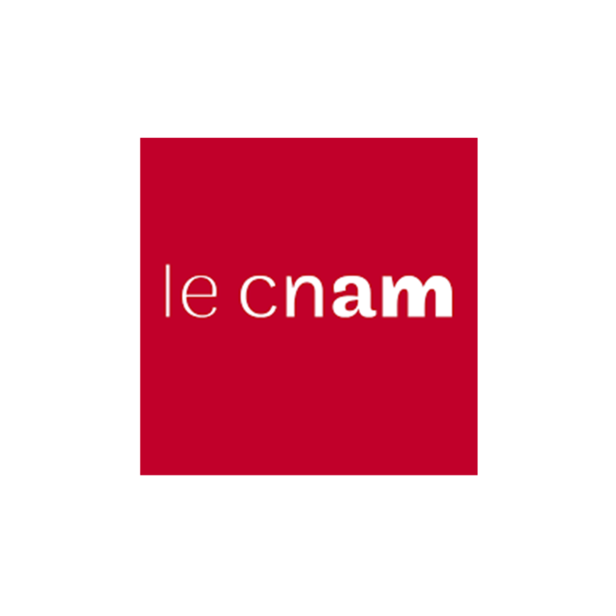
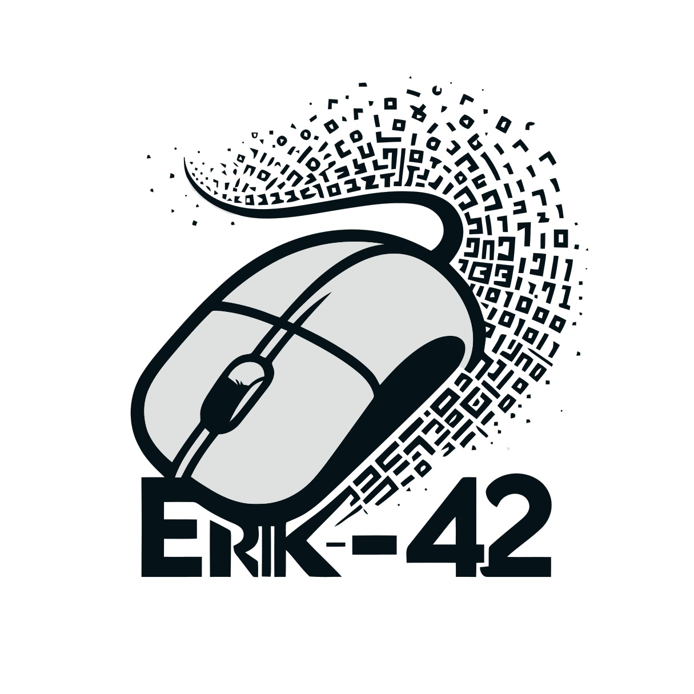

<!-- PROJECT LOGO -->
 

<!-- Titre à modifiés -->

  <h1>Modèle pour les nouveaux projets</h1>

<!-- TABLE OF CONTENTS -->

  
Table of Contents

  <ol>
    <li><a href="#about-the-project">About The Project</a></li>
    <li><a href="#description">Description</a></li>
    <li><a href="#os">OS</a></li>
    <li><a href="#built-with">Built With</a></li>
    <li><a href="#installation">Installation</a></li>
    <li><a href="#usage">Usage</a></li>
    <li><a href="#testez-le-projet">Testez le projet</a></li>
    <li><a href="#structure-du-projet">Structure du projet</a></li>
    <li><a href="#license">License</a></li>
    <li><a href="#contact">Contact</a></li>
  </ol>

<!-- ABOUT THE PROJECT -->

## About The Project

[![Contributors][contributors-shield]][contributors-url]
[![Forks][forks-shield]][forks-url]
[![Issues][issues-shield]][issues-url]
[![License][license-shield]][license-url]

<!-- Les liens wakatime à modifiés -->

Repo: 
 
Projet: 

<!-- Description à modifiés -->

### Description

Modèle pour les nouveaux projets

Il y a plusieurs éléments à modifiés dans ce modèle:

- Le nom du projet
- Le logo du projet
- La description du projet
- Les liens wakatime
- Les liens des badges
- Les OS supportés
- Les technologies utilisées
- Les instructions d'installation
- Les instructions d'utilisation
- Les instructions de test
- La License

(<a href="#readme-top">back to top</a>)

<!-- OS à modifiés -->

### OS supportés

<!-- TABLE OF OS -->

  
Table of OS

  <ul>
    <li>
      

        
Windows

        <ul>
          <li>- [x] Windows 7</li>
          <li>- [x] Windows 10</li>
          <li>- [x] Windows 11</li>
          <li>- [ ] Windows Server</li>
        </ul>
      

    </li>
    <li>
      

        
Mac

        <ul>
          <li>- [x] Mac OS X</li>
          <li>- [x] Mac OS Catalina</li>
          <li>- [x] Mac OS Big Sur</li>
          <li>- [ ] Mac OS Sierra</li>
          <li>- [ ] Mac OS Lion</li>
        </ul>
      

    </li>
    <li>
      

        
Linux

        <ul>
          <li>- [x] Ubuntu</li>
          <li>- [x] Debian</li>
          <li>- [ ] Fedora</li>
          <li>- [ ] Arch</li>
          <li>- [ ] CentOS</li>
          <li>- [ ] Red Hat</li>
        </ul>
      

    </li>
  </ul>

<!-- Techons à modifiés -->

### Built with

 

(<a href="#readme-top">back to top</a>)

<!-- Les instructions d'installation à modifiés -->

## Installation

(<a href="#readme-top">back to top</a>)

<!-- Les instructions d'utilisation à modifiés -->

## Usage

(<a href="#readme-top">back to top</a>)

<!-- Les instructions de test à modifiés -->

## Testez le projet

(<a href="#readme-top">back to top</a>)

## Structure du projet

Si vous souhaitez exporter la structure du projet
saisissez la commande suivante dans le terminal:

`node export-file-structure.js`
 

ou

double clicker sur le fichier:
 
[export-project-structure-linux-v1](export-project-structure-linux-v1)

(<a href="#readme-top">back to top</a>)

<!-- La license à modifiés -->

## License

Distributed under the MIT License. See `LICENSE.txt` for more information.

(<a href="#readme-top">back to top</a>)

<!-- NE PAS TOUCHER !! -->

## Contact

[![GitHub followers][github followers-shield]][github followers-url]
[![Stargazers][stars-shield]][stars-url]
[![GitHub repo][github repo-shield]][github repo-url]
[![wakatime][wakatime-shield]][wakatime-url]

[![Github Badge][github badge-shield]][github badge-url]
[![LinkedIn][linkedin-shield]][linkedin-url]

<a href = 'https://basillecorp.dev'>  basillecorp.dev</a>

Portfolio: 
https://bash-cv.vercel.app/

Mon CV:
 
[version Figma](https://www.figma.com/design/H17d3Plq2fxppmKcQXfB0p/Cv-Eric-Breteau?m=auto&t=enkiu3089axN0tBm-1) 
[version PDF](assets/docs/Cv-Erik_Mesen.pdf)

[https://buymeacoffee.com/meseneriko](https://buymeacoffee.com/meseneriko)

Contactez moi: [erik.mesen@basillecorp.dev](mailto:erik.mesen@basillecorp.dev)

(<a href="#readme-top">back to top</a>)

<!-- MARKDOWN LINKS & IMAGES -->
<!-- https://www.markdownguide.org/basic-syntax/#reference-style-links -->

<!-- Les liens badges à modifié -->

[contributors-shield]: https://img.shields.io/github/contributors/Erik-42/template-new-project
[contributors-url]: https://github.com/Erik-42/template-new-project/graphs/contributors
[forks-shield]: https://img.shields.io/github/forks/Erik-42/template-new-project
[forks-url]: https://github.com/Erik-42/template-new-project/forks
[issues-shield]: https://img.shields.io/github/issues-raw/Erik-42/template-new-project
[issues-url]: https://github.com/Erik-42/template-new-project/issues
[license-shield]: https://img.shields.io/github/license/Erik-42/template-new-project
[license-url]: https://github.com/Erik-42/template-new-project/blob/master/LICENSE.txt

<!-- Les badges de contact -
NE PAS TOUCHER ! -->

[github followers-shield]: https://img.shields.io/github/followers/Erik-42
[github followers-url]: https://github.com/followers/Erik-42
[stars-shield]: https://img.shields.io/github/stars/Erik-42
[stars-url]: https://github.com/Erik-42?tab=stars
[github repo-shield]: https://img.shields.io/badge/Repositories-73-blue
[github repo-url]: https://github.com/Erik-42/Erik-42?tab=repositories
[github repo file count (file type)-shield]: https://img.shields.io/github/directory-file-count/Erik-42/template-new-project
[github repo file count (file type)-url]: https://github.com/directory-file-count/Erik-42/template-new-project
[wakatime-shield]: https://wakatime.com/badge/user/f84d00d8-fee3-4ca3-803d-3daa3c7053a5.svg
[wakatime-url]: https://wakatime.com/@f84d00d8-fee3-4ca3-803d-3daa3c7053a5
[github badge-shield]: https://img.shields.io/badge/Github-Erik--42-155?style=for-the-badge&logo=github
[github badge-url]: https://github.com/Erik-42
[github all releases-shield]: https://github.com/Erik-42/template-new-project/total
[github all releases-url]: https://github.com/Erik-42/template-new-project/releases
[github repo size-shield]: https://img.shields.io/github/repo-size/Erik-42/template-new-project
[github repo size-url]: https://github.com/Erik-42/template-new-project
[linkedin-shield]: https://img.shields.io/badge/-LinkedIn-black.svg?style=for-the-badge&logo=linkedin&colorB=555
[linkedin-url]: https://www.linkedin.com/in/erik-mesen/
